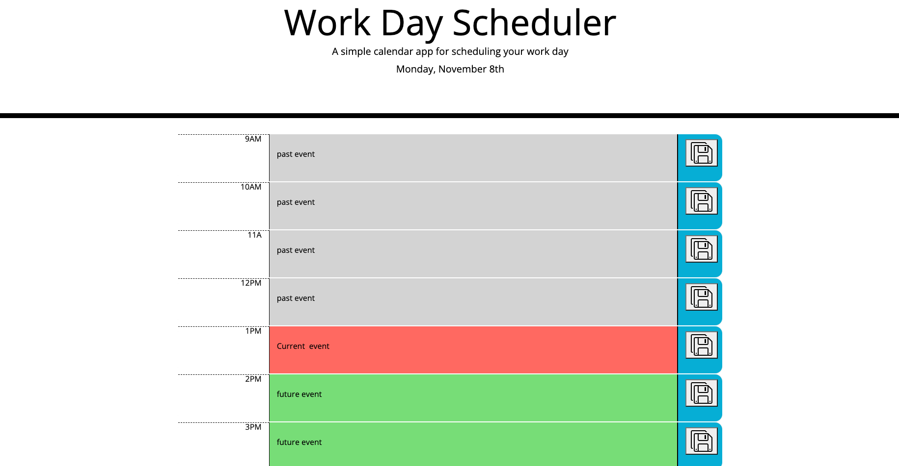

# Task Scheduler

## Project Description

A web Application to help employees to keep a better track of their tasks throughout the day.
Once the web page is looded the current date will appear on the top center, Showing current month and the day of the weeek. 
User has an option to add tasks that needs to be competed for the day every hour as well as updating those tasks with new tasks anytime. 
Once the user has added a task and click save the task will be added to the local storage. 
If the user refreeshes the page the tasks will be stored locally and all previously entered tasks  will show again on the list.
You can update existing tasks by clicking on them and re-saving them with the save button.
Each hour block will be colored in the follow ing order.Current hour(red), furure hours(green) and past hours (grey)

* Main page load with current date format for Current Day

* Main alnding page with all time blocks

* Main page showing other time blocks of current, past and future

